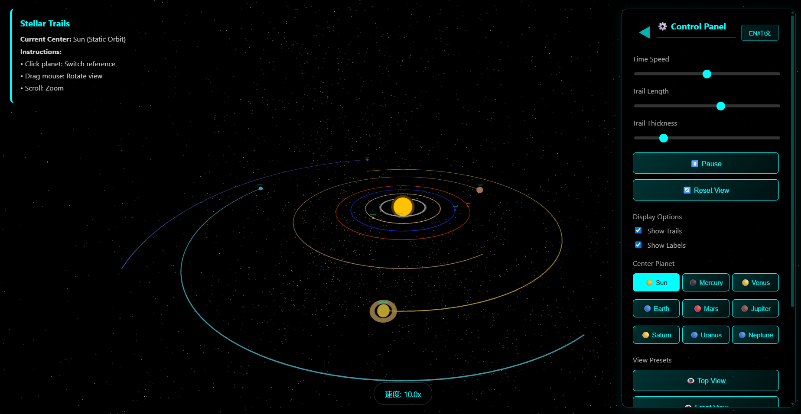
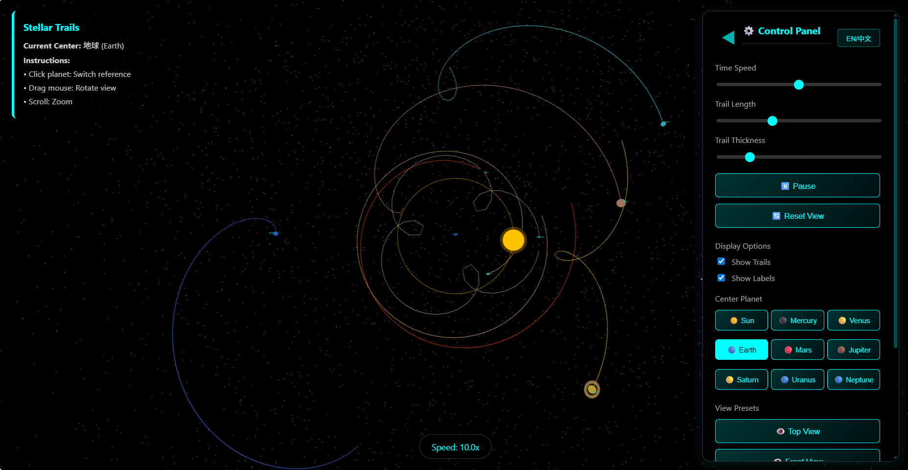

# Stellar Trails

[中文](README_ZH.md) | English

An interactive 3D solar system visualization web application featuring relative motion trails and switchable reference frames. Experience the solar system from different planetary perspectives with dynamic trail effects showing orbital paths.





## 🌟 Features

### Core Functionality
- **3D Solar System Rendering**: Complete solar system with Sun and 8 planets
- **Interactive Reference Frame Switching**: Click any planet to center your view on it
- **Dynamic Motion Trails**: Visualize orbital paths relative to the selected reference center
- **Procedural Textures**: Unique texture patterns for each celestial body
- **Realistic Lighting System**: Point light from Sun + ambient light with shadow support
- **Bilingual Support**: English and Chinese with automatic language detection

### Controls
- **Time Speed Control**: 0x - 20x adjustable
- **Trail Length Control**: 0 - 1000 points
- **Trail Thickness Control**: 0.1 - 5.0
- **Display Options**: Toggle trails, planet labels, and performance stats
- **View Presets**: Top, Front, Side, Diagonal, and Low-angle views
- **Pause/Resume**: Stop the animation at any time

### Interaction Methods
- **Mouse Drag**: Rotate camera view
- **Scroll Wheel**: Zoom in/out
- **Click Planet**: Switch reference center
- **Control Panel Buttons**: Switch reference center + adjust camera angle
- **Keyboard Shortcuts**:
  - Space: Pause/Resume
  - 1-5: Switch view presets
  - R: Reset view
  - ESC: Close panel/Reset
  - +/-: Adjust speed
  - H: Show help

## 🚀 Quick Start

### Prerequisites
- Modern browser (Chrome, Firefox, Safari, Edge, etc.)
- ES Modules and WebGL support

### Running the Application

#### Method 1: Python HTTP Server
```bash
python3 -m http.server 8000
```
Then visit: http://localhost:8000

#### Method 2: Node.js HTTP Server
```bash
npx http-server -p 8000
```
Then visit: http://localhost:8000

#### Method 3: Using the Startup Script
```bash
./start-server.sh
```

### Offline Usage
All dependencies are downloaded to the local `libs/` directory. The application supports complete offline operation without any network connection.

## 📁 Project Structure

```
/config/workspace/test/
├── index.html              # Main application file (single-file app)
├── README.md               # Project documentation (English)
├── README_ZH.md            # 项目说明文档 (中文)
├── AGENTS.md               # Developer context documentation
├── start-server.sh         # HTTP server startup script
└── libs/                   # Local dependencies
    ├── three/              # Three.js core library
    │   └── three.module.js
    ├── three-addons/       # Three.js add-ons
    │   └── controls/
    │       └── OrbitControls.js
    └── tween/              # Tween.js animation library
        └── tween.esm.js
```

## 🎮 User Guide

### Switching Reference Center
1. **Click a planet in the scene**: Immediately switch to that planet as the reference center, camera position unchanged
2. **Click control panel button**: Switch to that planet as reference center + camera moves to top-down view

### Observing Motion Trails
- After switching reference center, all celestial bodies display motion trails relative to that center
- Trail length automatically adjusts based on celestial body distance (distant bodies have longer trails)
- Adjust trail length and thickness using sliders

### Viewing Planet Details
1. Click any planet
2. Click the "📋 Show Details" button at the bottom of the screen
3. View detailed information (distance, diameter, orbital period, etc.)

### Adjusting Camera View
- Use "View Presets" buttons in the control panel
- Or use keyboard shortcuts 1-5

## 🔧 Tech Stack

- **Three.js (v0.160.0)**: 3D graphics rendering
- **Tween.js (v23.1.1)**: Animation tweening
- **Native JavaScript ES Modules**: Modular development
- **HTML5/CSS3**: User interface and styling

## 📊 Planet Data

| Planet | Distance (AU) | Diameter (Earth ×) | Orbital Period (days) | Color |
|--------|---------------|-------------------|----------------------|-------|
| Mercury | 0.39 | 0.38 | 88 | Gray |
| Venus | 0.72 | 0.95 | 225 | Golden |
| Earth | 1.00 | 1.00 | 365 | Blue |
| Mars | 1.52 | 0.53 | 687 | Orange-red |
| Jupiter | 5.20 | 11.20 | 4,333 | Brown |
| Saturn | 9.50 | 9.45 | 10,759 | Yellow (with rings) |
| Uranus | 19.20 | 4.00 | 30,687 | Cyan |
| Neptune | 30.10 | 3.88 | 60,190 | Deep blue |

## 🎨 Control Panel

### Time Speed
- Slider range: 0x - 20x
- Real-time adjustment of planetary revolution speed

### Trail Controls
- **Length**: 0 - 1000, controls number of trail points
- **Thickness**: 0.1 - 5.0, controls trail line thickness

### Display Options
- **Show Trails**: Toggle trail visibility
- **Show Labels**: Toggle planet name labels (supports bilingual switching)
- **Show Performance Stats**: Show live FPS / frame time / render calls / triangles / geometries

### Quality Mode
- **Performance** (default): Lower geometry tessellation + 1024 shadow map for smoother frame pacing
- **High**: Higher tessellation + 2048 shadow map for better visual fidelity

### Center Planet
- 9 buttons corresponding to Sun and 8 planets
- Click to switch reference center

### View Presets
- Top: View from directly above
- Front: View from the front
- Side: View from the side
- Diagonal: 45-degree angle view
- Low: Low-angle view

### Language Toggle
- Click "EN/中文" button to switch between English and Chinese
- Automatically detects browser language on startup
- All UI elements and planet labels switch languages dynamically

## ⌨️ Keyboard Shortcuts

| Key | Function |
|-----|----------|
| Space | Pause/Resume animation |
| 1 | Top view |
| 2 | Front view |
| 3 | Side view |
| 4 | Diagonal view |
| 5 | Low-angle view |
| R | Reset view |
| ESC | Close info panel/Reset |
| + | Increase time speed |
| - | Decrease time speed |
| H | Show help information |

## 🔬 Special Features

### Trail System
- Based on relative coordinate calculations
- Uses fixed-capacity ring-buffer sampling to reduce allocation and array churn
- Rebuilds TubeGeometry only when a new sample is accepted (time/distance threshold)
- Automatically regenerates when switching reference centers or quality mode

### Camera System
- Smooth animation transitions
- Supports multiple view presets
- Keeps celestial body centered during focus
- Supports free rotation and zooming

### Procedural Textures
Each planet features unique procedurally generated textures:
- **Mercury**: Crater pattern
- **Venus**: Noise pattern
- **Earth**: Continent pattern with clouds
- **Mars**: Crater pattern
- **Jupiter**: Storm pattern with Great Red Spot
- **Saturn**: Banded pattern with rings
- **Uranus**: Noise pattern
- **Neptune**: Noise pattern

### Bilingual Support
- Automatic language detection based on browser settings
- Manual language toggle via control panel
- All UI elements dynamically switch languages
- Planet labels update in real-time when language changes

## ✅ Performance Verification

1. Run locally:
   - `python3 -m http.server 8000` or `npx http-server -p 8000`
   - Open `http://localhost:8000`
2. Regression scenarios:
   - Switch center: Sun / Earth / Jupiter
   - Toggle trails and quickly adjust trail length/thickness
   - Toggle info panel and switch view presets
3. Compare before/after (Chrome DevTools Performance, 30-60s):
   - Average FPS, P95 frame time, GC frequency
   - `renderer.info.render.calls`, `renderer.info.render.triangles`, `renderer.info.memory.geometries`
4. Suggested acceptance:
   - Noticeable P95 frame-time improvement with trails enabled and long length
   - No obvious trail flicker/break or interaction regressions
   - Stable geometry/memory indicators without continuous growth

## 📄 License

This project is for learning and demonstration purposes only.

## 🤝 Contributing

Issues and Pull Requests are welcome!

---

**Enjoy exploring the solar system!** 🌌